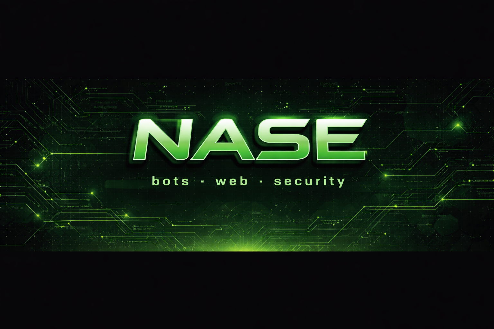

# nase

developer focused on bots, web applications, automation, and security tooling.

i build discord and telegram bots, develop custom websites, and create tools related to networking and cybersecurity. when i'm not working on client projects or personal ideas, i'm usually experimenting with new technologies and building things that sound interesting.

## areas of interest

- cybersecurity
- networking
- backend systems
- web development
- automation
- reverse engineering

🌐 https://nasedev.xyz
📨 https://t.me/nasedev
